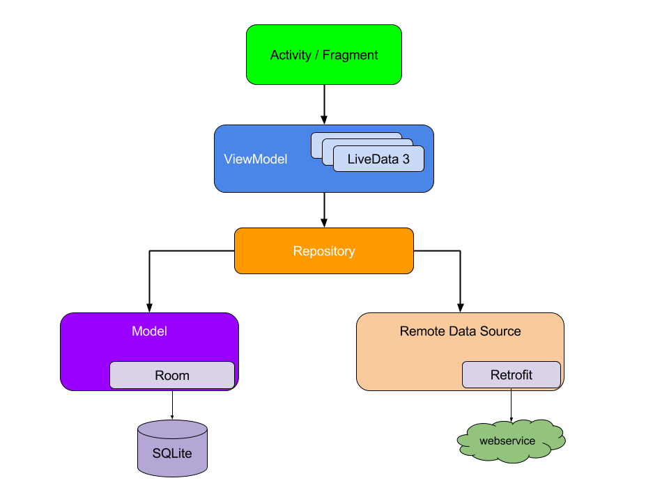
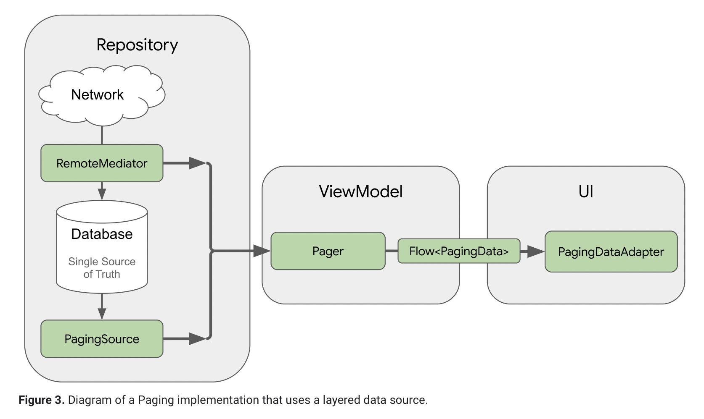
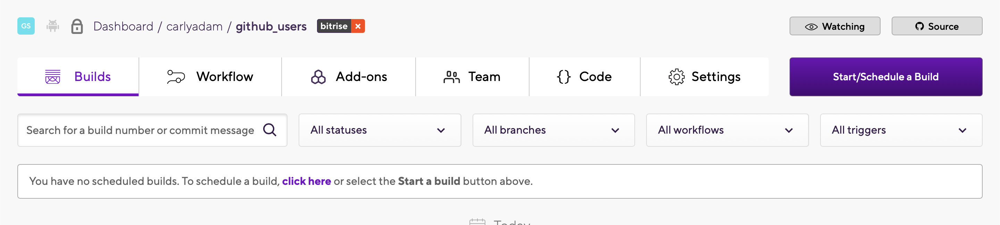

# Github Users Test

## Features

* ✔️ Kotlin
* ✔️ Architecture:[ MVVM](https://developer.android.com/jetpack/docs/guide)
* ✔️ DI:[ Hilt](https://developer.android.com/training/dependency-injection/hilt-android)
* ✔️ Handling process death:[ SaveStateHandle](https://developer.android.com/topic/libraries/architecture/viewmodel-savedstate)
* ✔️ Crash Report:[ Bugsnag](https://www.bugsnag.com)
* ✔️ Mock:[ MockK](https://github.com/mockk/mockk)
* ✔️ Android Studio Version:[ 4.2]
* ✔️ [View binding](https://developer.android.com/topic/libraries/view-binding)
* ✔️ [Coroutines](https://developer.android.com/topic/libraries/architecture/coroutines)
* ✔️ [AndroidX](https://developer.android.com/jetpack/androidx)
* ✔️ [Bitrise](https://www.bitrise.io)
* ✔️ [Leakcanary](https://github.com/square/leakcanary)
* ✔️ [KtLint](https://github.com/pinterest/ktlint)
* ✔️ [Pagination](https://developer.android.com/topic/libraries/architecture/paging/v3-overview)
* ✔️ [Flow](https://developer.android.com/kotlin/flow)
* ✔️ [Shimmer](https://github.com/facebook/shimmer-android)
* ✔️ [Glide](https://github.com/bumptech/glide)
* ✔️ [Firebase](https://firebase.google.com)


### How to build
```
1-Git clone
2-Use Android Studio(4.2 or up, Arctic Fox|2020.3.1 Beta 3 in my case) /File/Open
3-Sync Project with Gradle
4-Done
```

### Apk

* -You can find the apk file [here](apk/giphy.apk)

### Test

* -You can find useful unit test in this [directory](app/src/test/java/com/carlyadam/github)
* -You can find useful screenshots test in this [directory](app/src/androidTest/java/com/carlyadam/github)

## Useful notes

### MVVM Arquitecture



### Pagin Arquitecture



### CI/CD Report



### Points to improve with more time

* Create screenshots test for all the views
* Integrate Snapshot test with [Firebase Test Lab](https://firebase.google.com/products/test-lab)
* Create unit test for different pagination scenarios.
* Check and test leakcanary memory leaks reports.


Enjoy it ;)